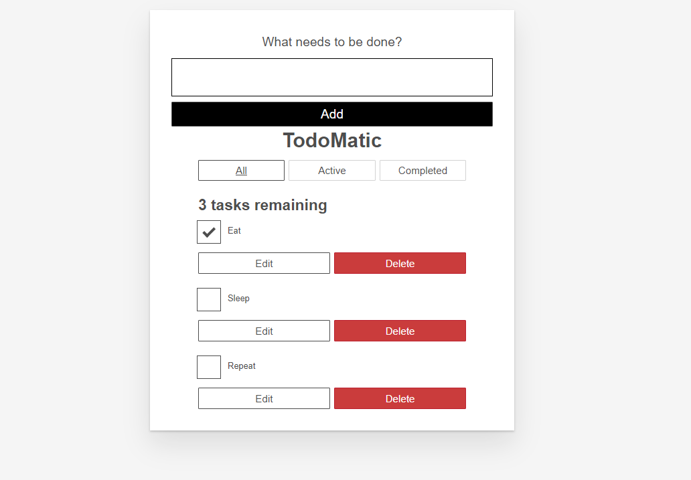

<h3 align="center">
    
    <br><br>
    <br>
</h3>

[](https://github.com/AntonioSilvaAzevedo)


 
# :barber: MDN React

project carried out with the concepts of React using the MDN!
it consists of adding, editing and deleting tasks. Using filters to display tasks.

Running the Application:

```sh
  # Install the dependencies
  $ npm install

  # Launch the web application
  $ npm start

```
<br>


<h3 align="center">
    
    <br><br>
    
</h3>


<h4 align="center">
    Feito com 💜 by <a href="https://www.linkedin.com/in/antonio-carlos-44b106129/" target="_blank">Antonio Carlos</a>
</h4>